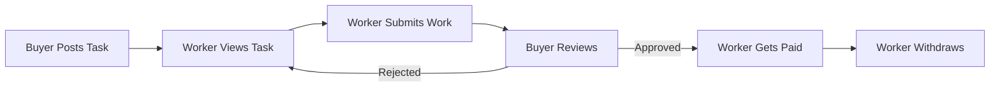

# 🚀 Micro Gig Nexus - Micro Tasking & Earning Platform

A modern, full-stack micro-tasking platform where workers complete small tasks to earn rewards and buyers post tasks to get work done efficiently.

[](https://micro-gig-nexus.lovable.app)
[](https://lovable.dev)

## 🌐 Live Demo

**[https://micro-gig-nexus.lovable.app](https://micro-gig-nexus.lovable.app)**

## 📋 Overview

Micro Gig Nexus is a comprehensive platform designed to connect task creators (Buyers) with task completers (Workers). The platform features a robust coin-based economy, real-time notifications, and a powerful admin dashboard for platform management.

## ✨ Features

### 👷 Worker Features
- **Browse Tasks** - View available tasks with detailed descriptions and rewards
- **Submit Work** - Complete tasks and submit proof of work
- **Track Submissions** - Monitor submission status (pending, approved, rejected)
- **Earn Coins** - Receive coins upon task approval
- **Withdraw Earnings** - Request withdrawals via multiple payment methods
- **Notifications** - Stay updated on task approvals and payments

### 💼 Buyer Features
- **Post Tasks** - Create tasks with descriptions, rewards, and deadlines
- **Manage Tasks** - View, edit, and delete posted tasks
- **Review Submissions** - Approve or reject worker submissions
- **Purchase Coins** - Buy coins to fund task rewards
- **Payment History** - Track all coin purchases and transactions
- **Notifications** - Get notified when workers submit tasks

### 🛡️ Admin Features
- **User Management** - View all users, change roles, manage accounts
- **Task Oversight** - Monitor all platform tasks
- **Withdrawal Management** - Approve/reject withdrawal requests
- **Platform Statistics** - View platform-wide metrics and analytics

## 🛠️ Tech Stack

| Category | Technology |
|----------|------------|
| **Frontend** | React 18, TypeScript, Vite |
| **Styling** | Tailwind CSS, shadcn/ui |
| **State Management** | TanStack React Query |
| **Routing** | React Router DOM v6 |
| **Backend** | Lovable Cloud (Supabase) |
| **Database** | PostgreSQL with Row Level Security |
| **Authentication** | Email-based authentication |
| **Charts** | Recharts |

## 📁 Project Structure

```
src/
├── components/
│   ├── dashboard/        # Dashboard layout components
│   ├── home/             # Landing page sections
│   ├── layout/           # App layout (Navbar, Footer)
│   └── ui/               # Reusable UI components (shadcn/ui)
├── hooks/
│   ├── useAuth.tsx       # Authentication hook
│   └── use-mobile.tsx    # Mobile detection hook
├── integrations/
│   └── supabase/         # Database client & types
├── pages/
│   ├── dashboard/        # Dashboard pages
│   │   ├── AddTask.tsx
│   │   ├── AdminHome.tsx
│   │   ├── AdminWithdrawals.tsx
│   │   ├── BuyerHome.tsx
│   │   ├── ManageTasks.tsx
│   │   ├── ManageUsers.tsx
│   │   ├── MySubmissions.tsx
│   │   ├── MyTasks.tsx
│   │   ├── Notifications.tsx
│   │   ├── PaymentHistory.tsx
│   │   ├── PurchaseCoins.tsx
│   │   ├── TaskDetails.tsx
│   │   ├── TaskList.tsx
│   │   ├── Withdrawals.tsx
│   │   └── WorkerHome.tsx
│   ├── Dashboard.tsx
│   ├── Index.tsx
│   ├── Login.tsx
│   ├── Register.tsx
│   └── NotFound.tsx
└── lib/
    └── utils.ts          # Utility functions
```

## 🗄️ Database Schema

### Tables

| Table | Description |
|-------|-------------|
| `profiles` | User profiles with coins balance |
| `user_roles` | User role assignments (worker/buyer/admin) |
| `tasks` | Task listings posted by buyers |
| `submissions` | Worker task submissions |
| `payments` | Coin purchase transactions |
| `withdrawals` | Withdrawal requests |
| `notifications` | User notifications |

### Security
- **Row Level Security (RLS)** enabled on all tables
- Role-based access control
- Secure authentication flow
- Protected API endpoints

## 🚀 Getting Started

### Prerequisites

- Node.js 18+ and npm
- Git

### Installation

1. **Clone the repository**
   ```bash
   git clone <YOUR_GIT_URL>
   cd micro-gig-nexus
   ```

2. **Install dependencies**
   ```bash
   npm install
   ```

3. **Start development server**
   ```bash
   npm run dev
   ```

4. **Open in browser**
   ```
   http://localhost:5173
   ```

## 📱 Screenshots

### Landing Page
- Hero section with platform introduction
- Features showcase
- How it works guide
- Best workers leaderboard
- Testimonials
- Call to action

### Dashboard
- Role-specific home pages
- Task management interface
- Submission tracking
- Coin management
- Withdrawal system

## 🔐 User Roles

| Role | Permissions |
|------|-------------|
| **Worker** | Browse tasks, submit work, withdraw earnings |
| **Buyer** | Post tasks, review submissions, purchase coins |
| **Admin** | Full platform access, user management, withdrawals |

## 💰 Coin Economy

- **1 Coin = $1 USD**
- Buyers purchase coins to fund task rewards
- Workers earn coins upon task approval
- Minimum withdrawal: 10 coins
- Maximum withdrawal: Available balance minus pending withdrawals

## 🔄 Workflow



## 🤝 Contributing

1. Fork the repository
2. Create your feature branch (`git checkout -b feature/AmazingFeature`)
3. Commit your changes (`git commit -m 'Add some AmazingFeature'`)
4. Push to the branch (`git push origin feature/AmazingFeature`)
5. Open a Pull Request

## 📄 License

This project is open source and available under the [MIT License](LICENSE).

## 🙏 Acknowledgments

- Built with [Lovable](https://lovable.dev)
- UI Components from [shadcn/ui](https://ui.shadcn.com)
- Icons from [Lucide](https://lucide.dev)

---

<p align="center">
  Made with ❤️ using <a href="https://lovable.dev">Lovable</a>
</p>
